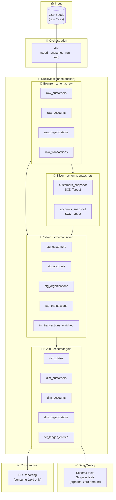
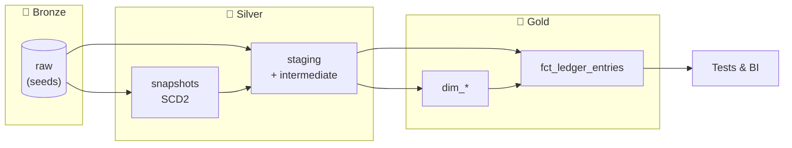

# Finance DW — Solution Architecture

High-level architecture for the financial data warehouse: Medallion layers (Bronze → Silver → Gold) implemented with **dbt** and **DuckDB**.

---

## Diagram (Mermaid)

The diagram below renders on GitHub and in any Markdown viewer that supports Mermaid.

---

## Simplified flow (one page)

---

## Component summary

| Component | Role |
|-----------|------|
| **CSV seeds** | Source-aligned raw data loaded via `dbt seed` into schema `raw`. |
| **dbt** | Orchestrates seed, snapshots, model DAG, and tests. |
| **DuckDB** | Single-file database; schemas `raw`, `snapshots`, `silver`, `gold`. |
| **Bronze (raw)** | Immutable copy of source; minimal or no transformation. |
| **Silver (snapshots)** | SCD Type 2 history for customers and accounts. |
| **Silver (staging + int)** | Cleans, renames, casts; reusable joins (e.g. transactions enriched). |
| **Gold** | Star-style dimensions and fact table; enforced contracts. |
| **Tests** | Schema tests + singular tests (referential integrity, business rules). |
| **BI / Reporting** | Consume Gold only for analytics. |

---

For run order and setup, see [README.md](README.md). For detailed lineage and design, see [PROJECT_ANALYSIS.md](PROJECT_ANALYSIS.md).
